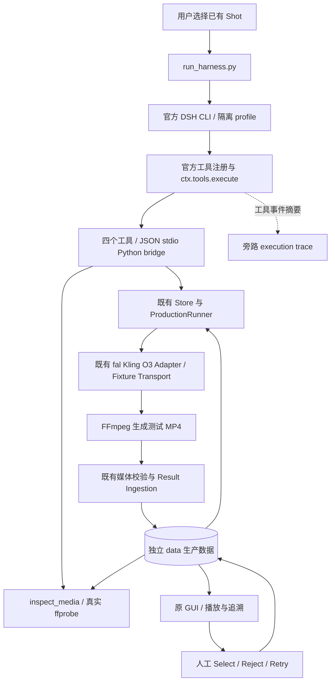

# A-04 实际架构

```mermaid
flowchart TD
  User[用户选择已有 Shot] --> Launcher[run_harness.py]
  Launcher --> DSH[官方 DSH CLI / 隔离 profile]
  DSH --> Registry[官方工具注册与 ctx.tools.execute]
  Registry --> Bridge[四个工具 / JSON stdio Python bridge]
  Bridge --> Core[既有 Store 与 ProductionRunner]
  Core --> Adapter[既有 fal Kling O3 Adapter / Fixture Transport]
  Adapter --> FFmpeg[FFmpeg 生成测试 MP4]
  FFmpeg --> Ingest[既有媒体校验与 Result Ingestion]
  Ingest --> Data[(独立 data 生产数据)]
  Data --> Core
  Bridge --> Probe[inspect_media / 真实 ffprobe]
  Data --> Probe
  Registry -.工具事件摘要.-> Trace[旁路 execution trace]
  Data --> GUI[原 GUI / 播放与追溯]
  GUI --> Human[人工 Select / Reject / Retry]
  Human --> Data
```

固定顺序：读取上下文 → 构建并保存 Task 与 pending Execution → 推进同一次 Fixture 执行并入库 → ffprobe 探测 → 回读。没有模型规划、真实 Provider 网络请求或自动审核。DSH 退出后原 GUI 独立使用同一数据；Trace 不是数据主权层。
