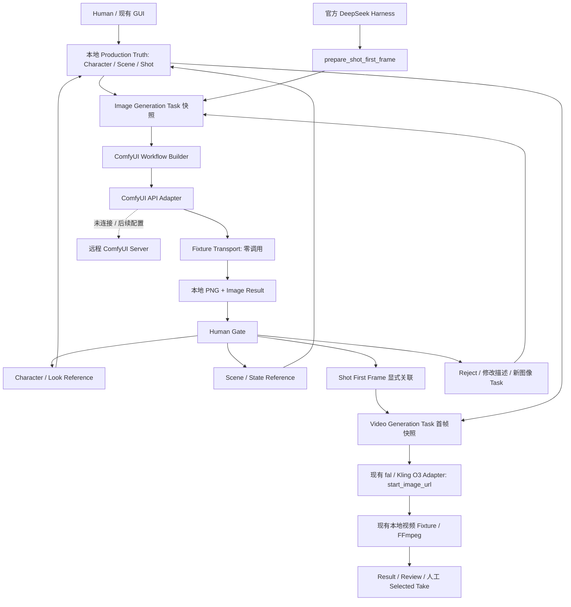

# A-06 实际架构

```mermaid
flowchart TD
  GUI[Human / 现有 GUI] --> Truth[本地 Production Truth: Character / Scene / Shot]
  Truth --> IT[Image Generation Task 快照]
  DSH[官方 DeepSeek Harness] --> Tool[prepare_shot_first_frame]
  Tool --> IT
  IT --> WB[ComfyUI Workflow Builder]
  WB --> CA[ComfyUI API Adapter]
  CA --> FT[Fixture Transport: 零调用]
  CA -. 未连接 / 后续配置 .-> Remote[远程 ComfyUI Server]
  FT --> IR[本地 PNG + Image Result]
  IR --> HG[Human Gate]
  HG --> CR[Character / Look Reference]
  HG --> SR[Scene / State Reference]
  HG --> FF[Shot First Frame 显式关联]
  HG --> Retry[Reject / 修改描述 / 新图像 Task]
  Retry --> IT
  CR --> Truth
  SR --> Truth
  FF --> VT[Video Generation Task 首帧快照]
  Truth --> VT
  VT --> Fal[现有 fal / Kling O3 Adapter: start_image_url]
  Fal --> VF[现有本地视频 Fixture / FFmpeg]
  VF --> VR[Result / Review / 人工 Selected Take]
```

实线均在本轮零调用环境真实运行。虚线是尚未连接的远程执行环境。DSH 不拥有资产、不暴露 Promote 工具；退出后 GUI 与 Store 可独立读取。首帧关联在 first_frames/，视频最终选择仍在 reviews/，语义和数据分离。
